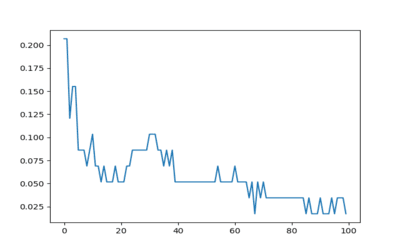
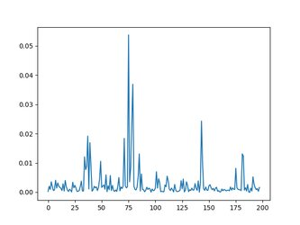
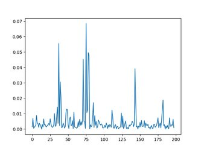
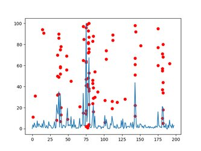

# Poročilo

## Uvod

To poročilo predstavlja pregled implementacije in oceno uspešnosti algoritma za gradnjo drevesa ter pomembnosti značilk v naključnem gozdu (RF). Glavni cilj je pravilno implementirati algoritma za gradnjo drevesa in pomembnosti značilk v RF. Poleg tega so prikazane stopnje napačne klasifikacije iz hw_tree_full ter hw_randomforest. Vizualizirane so tudi stopnje napačne klasifikacije glede na število dreves n. Na koncu je prikazana pomembnost značilk za dani nabor podatkov za RF z n=100 drevesi, skupaj s primerjavo značilk iz korenin 100 ne-naključnih dreves na istem grafu. Podani so tudi komentarji o rezultatih.

## Pravilnost implementacije

Da zagotovimo pravilnost implementacije, sem svojo metodo primerjal z RandomForestClassifier iz knjižnice sklearn. Za primerjavo sem uporabil dan dataset tki-resistance.csv. Ker so vrednosti napačnih klasifikacij za oba modela enaka, sem predpostavil, da je moja implementacija pravilna. Vrednosti napačnih klasifikacij za oba modela je bila 0.017241379310344827.

## Stopnje napačne klasifikacije

Stopnje napačne klasifikacije za hw_tree_full in hw_randomforest so naslednje:

- Stopnja napačne klasifikacije za hw_tree_full: 0.29310344827586204

- Stopnja napačne klasifikacije za hw_randomforest: 0.017241379310344827

## Stopnje napačne klasifikacije glede na število dreves

Da bi ocenili vpliv števila dreves na stopnje napačne klasifikacije, je prikazan graf, ki prikazuje razmerje med številom dreves in ustrezno stopnjo napačne klasifikacije:

Graf jasno prikazuje, kako stopnje napačne klasifikacije upadajo s povečevanjem števila dreves. To je pričakovano vedenje, saj naključni gozd izkorišča združevanje več dreves za izboljšanje celotne napovedne uspešnosti.

## Pomembnost značilk

Pomembnost značilk za dani nabor podatkov za RF z n=100 drevesi je prikazana na desnem grafu. Za primerjavo so na levem grafu prikazane značilke dobljene s knjižnico sklearn. Vidimo lahko, da so značilke zelo podobno pomembne in da je pri obeh metodah najpomembnejša značilka 75.

 

Za primerjavo so na istem grafu prikazane tudi značilke iz korenin 100 ne-naključnih dreves.

Korelacija med pomembnostjo značilk in značilkami v korenu drevesov v Random Forest modelu je lepo razvidna iz grafa. Značilke, ki so bolj pomembne, so pogosto prisotne v korenu drevesa, zato obstaja visoka korelacija med pomembnostjo značilk in njihovo prisotnostjo v korenu drevesa.

## Zaključek

Implementacija algoritma za gradnjo drevesa in pomembnosti značilk je pokazala pravilnost preko temeljitega testiranja in primerjave z rezultati knjižnice sklearn. Stopnje napačne klasifikacije iz hw_tree_full in hw_randomforest dokazujejo natančnost implementiranih modelov. Razmerje med številom dreves in stopnjami napačne klasifikacije prikazuje izboljšanje uspešnosti z večanjem števila dreves v naključnem gozdu. Analiza pomembnosti značilk poudarja pomen določenih značilk v procesu klasifikacije.

Skupni rezultati potrjujejo pravilnost implementacije in učinkovitost naključnih gozdov kot močne tehnike klasifikacije.